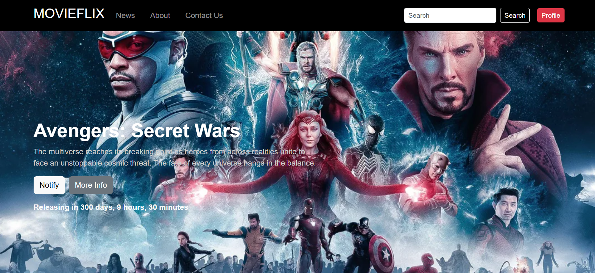
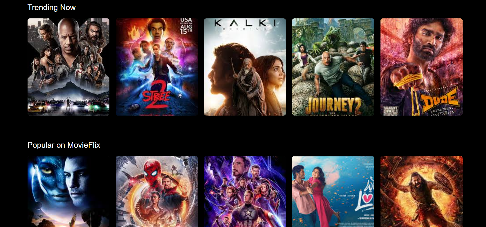
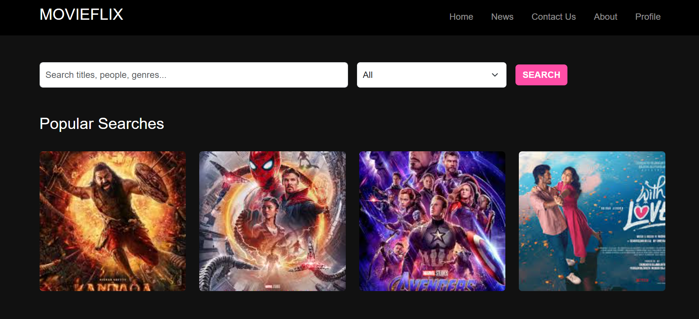
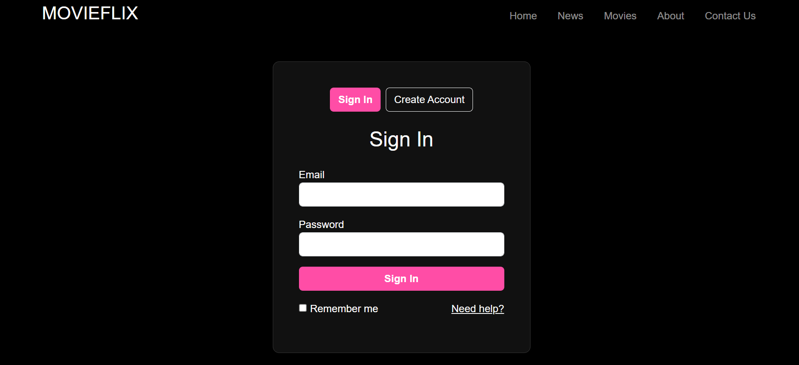
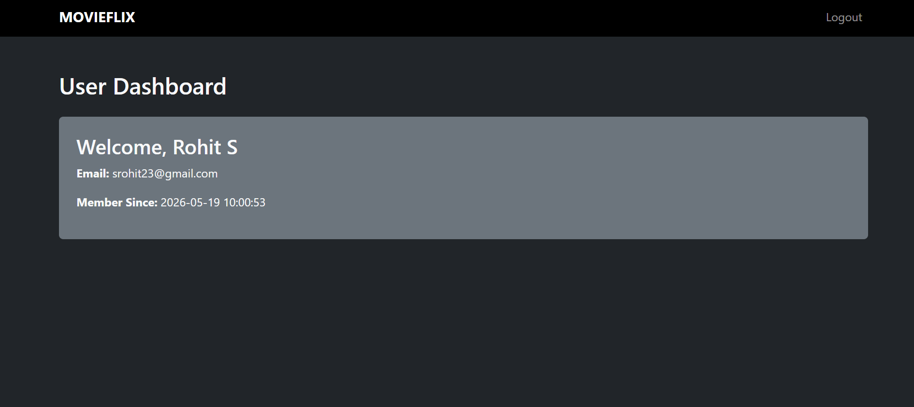
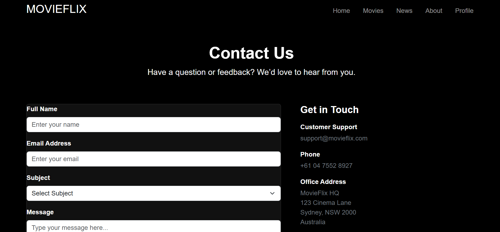
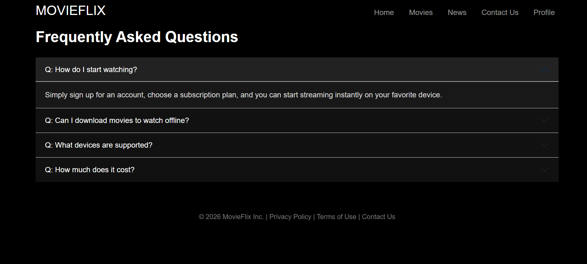

# 🎬 MovieFlix — Netflix Inspired Frontend Clone

A fully responsive Netflix-inspired clone built with Bootstrap 5, HTML, CSS, JavaScript, Node.js, Express.js and SQLite3. Features user authentication with a backend database, dynamic navigation, a contact form with modal feedback, and a clean dark cinema-themed UI across multiple pages.



## 🛠️ Built With

- HTML5
- CSS3
- JavaScript (ES6+)
- Bootstrap 5
- Node.js
- Express.js
- SQLite3 (database)
- localStorage (client-side session management)
- GitHub Pages (deployment)

## ✨ Features

- 🎬 Netflix-inspired dark UI theme
- 🏠 Home page with hero section and movie listings
- 🔍 Movie search and browse page
- 📰 News and updates page
- 👤 User authentication — Sign Up and Sign In
- 🔐 Password validation and confirmation
- ✅ User already exists detection via database
- 💾 localStorage based user session management
- 🔄 Auto redirect to dashboard after login
- 📊 User dashboard after successful login
- 📞 Contact form with success modal
- ℹ️ About page
- 📱 Fully responsive across all devices
- 🍔 Mobile hamburger menu
- 🎭 Bootstrap modals for all user feedback
- 🔒 Navbar updates dynamically based on login state

## 📸 Screenshots

### Home Page


### Movies Page


### Account Page


### Dashboard


### Contact Page


### News Page


### About Page


## 🚀 Getting Started

### Prerequisites
- Node.js installed
- npm

### Installation

1. Clone the repo
```bash
git clone https://github.com/pratham-amin/MovieFlix
```

2. Navigate to the project folder
```bash
cd MovieFlix
```

3. Install dependencies
```bash
npm install
```

4. Start the server
```bash
node server.js
```

5. Open your browser and visit
```bash
http://localhost:3000
```

## 🌐 Pages

| Page | Description |
|---|---|
| Home | Hero section with featured movies and highlights |
| Movies | Browse and search movie listings |
| News | Latest movie news and updates |
| Account | Sign In and Sign Up with form validation |
| Dashboard | User profile page after successful login |
| Contact | Contact form with Bootstrap success modal |
| About | About MovieFlix and the platform |

## 🔌 API Routes

| Method | Route | Description |
|---|---|---|
| POST | `/api/users` | Register a new user |
| POST | `/api/users/login` | Login existing user |
| POST | `/api/messages` | Submit contact form message |
| GET | `/api/messages` | Get all contact messages |

## 🔐 Authentication Flow

MovieFlix uses **Express.js + SQLite3** on the backend and **localStorage** for client-side session management:

1. User signs up → details saved to SQLite database via Express API
2. Duplicate email check — shows warning modal if account exists in database
3. User signs in → credentials verified against SQLite database
4. Wrong credentials → error modal shown
5. Successful login → user data saved to localStorage → redirects to dashboard
6. Navbar updates dynamically — Account link changes to Profile
7. Logout clears user session from localStorage

## 🗄️ Database Schema

### Users Table
| Column | Type | Description |
|---|---|---|
| id | INTEGER | Primary key, auto increment |
| name | TEXT | Full name |
| email | TEXT | Unique email address |
| password | TEXT | User password |
| created_at | DATETIME | Account creation date |

### Messages Table
| Column | Type | Description |
|---|---|---|
| id | INTEGER | Primary key, auto increment |
| name | TEXT | Sender full name |
| email | TEXT | Sender email |
| subject | TEXT | Message subject |
| message | TEXT | Message content |
| created_at | DATETIME | Submission date |

## 🎭 Modal Feedback System

All user interactions use Bootstrap modals instead of browser alerts:

| Action | Modal |
|---|---|
| Login success | ✅ Welcome back modal + redirect |
| Login failed | ❌ Invalid credentials modal |
| Sign up success | 🎉 Account created modal |
| User already exists | ⚠️ Account exists modal |
| Contact form submit | ✅ Message sent modal |

## 👨‍💻 About the Developer

Built by **Pratham Sathish** — Frontend Developer and MIT student at Deakin University, Burwood.

- 📍 Burwood, VIC, Australia
- 📧 sprathamamin23@gmail.com
- 💼 [LinkedIn](https://linkedin.com/in/pratham-s-5a3856290)
- 💻 [GitHub](https://github.com/pratham-amin)
- 🌐 [Portfolio](https://portfolio-pratham-amin.app)

